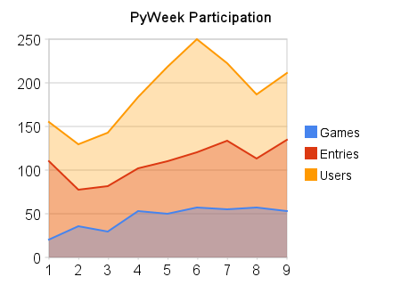

========================================
Help for using the PyWeek Challenge Site
========================================

:revision date: 2008/09/07
:author: Richard Jones <richard@pyweek.org>

.. contents::

0. How the heck do I write a game?
----------------------------------

There's some great tutorials out there and Al Sewigart, the author of the
free book *Invent Your Own Computer Games with Python* has compiled a `list
of the top 10`__.

__ http://inventwithpython.com/blog/2010/09/01/the-top-10-pygame-tutorials/

1. So you want to enter as an individual?
-----------------------------------------

You should log into the PyWeek site and go to the latest challenge in the
sidebar. Then in the the sidebar you should see "Register Entry".
Click that and fill out the details. Leave the "Team Members" bit blank.

Once you've done that, your entry will appear under your "Your entries" list.

You may add diary entries and upload files or screenshots to this entry
(the latter only once the challenge has started).

2. So you want to enter as a team?
----------------------------------

This step should be performed by the team leader.

You should log into the PyWeek site and go to the latest challenge in the
sidebar. Then in the sidebar you
should see "Register Entry". Click that and fill out the details. You may
fill in the "Team Members" bit now or come back and edit it later.

Once they've done that, their entry will appear under your "Your entries" list.

You may add diary entries and upload files or screenshots to the team entry
(the latter only once the challenge has started).

Only the team leader will be able to manage the team entry (change its name or
membership listing).

3. Editing your personal details
--------------------------------

Once you've logged in use the "Profile" link in the sidebar to change your
name, email address or password.

4. Don't want an Entry any more?
--------------------------------

Just ask Richard to remove it. Mail him at richard@pyweek.org

5. Want to change Team Leaders?
-------------------------------

Just ask Richard to change it. Mail him at richard@pyweek.org

6. Want to join a team?
-----------------------

Ask the team leader of that team to add you.

7. What to do before the challenge starts
-----------------------------------------

1. Make sure you have working versions of the libraries you're going to use.
2. Make sure you can build packages to submit as your final submission (if
   you're going to use py2exe, make sure you know how to use it and that it
   works).
3. If you don't have access to Linux, Windows or a Mac to test on, contact
   friends, family or other competitors to find someone who is able to test
   for you.

8. What do do during the challenge
----------------------------------

1. Plan on spending at least several hours packaging and testing your
   packaging.
2. Allow time for planning your game (for example 1/5 of the total time)
3. Allow time for polishing the game by adding instructions, opening menus,
   level transition screens, game over screen (for example 1/5 of the total
   time)
4. Upload screenshots and put them in diary entries!
5. Hang around in the IRC channel, irc.freenode.net channel #pyweek

9. How to submit your entry
---------------------------

Visit your entry's page any time during the challenge and up to 24 hours
after the finish to upload your file(s). You may upload as many files
as necessary, including screenshots.

The server will become heavily loaded at deadline times. Given that there
is an entire 24-hour period in which to upload your files after the 
challenge finishes there will be no leniency for failure to upload.

10. What to submit as your entry
--------------------------------

Consider the advice at http://www.pygame.org/wiki/distributing

**We recommend you download** the `Skellington 1.9`__ package and use that as the starting-point
for your game.

__ http://media.pyweek.org/static/skellington-1.9.zip

For this challenge,

1. Always use either ZIP or TAR / GZIP to bundle your entry.
2. Always use a top-level directory.
3. You **MUST** include a README.txt which at a minimum indicates:

   - who wrote the code
   - who created the artwork
   - *how to run the game*
   - the licence for the game (the Free Software Foundation has a handy
     `page of free software licenses`__)
   - what dependencies need to be installed
   - a plug for the challenge is nice :)

4. If possible, you should bundle other libs you've used. If it's pure
   Python, then it may be bundled straight. If not, then consider including
   the source for the library.
5. If your entry is large (greater than 1MB) then you might want to use
   the `pyweek uploader`__ script to upload it, as it will handle bigger
   uploads better.

__ http://www.fsf.org/licensing/licenses
__ http://media.pyweek.org/static/pyweek-upload.py

11. When does PyWeek run?
-------------------------

PyWeek runs every 6 months in Spring/Autumn. This usually works out to be
around the first week of April and September.

12. When can I sign up?
-----------------------

Registration for PyWeek opens one month before the challenge start date
and continues through until the very end of the week-long challenge.

Yes, you can sign up during the week.

13. How do I upload a file?
---------------------------

You may only upload a file during the running of the challenge (ie. after the
start date). If you wish to upload outside of that time, contact Richard at
richard@pyweek.org

To upload a file:

1. log in,
2. select the entry you wish to upload it for in the sidebar,
3. select "Upload File" or "Upload Screenshot" in the sidebar, and
4. fill out the "Upload a File" form.

See the separate section `9. How to submit your entry`_ for more information
about submitting your entry to the site.

14. How do I post a diary entry?
--------------------------------

To post an entry:

1. log in,
2. select the entry you wish to post the entry for in the sidebar,
3. select "Add Diary Entry" in the sidebar, and
4. fill out the form.

Your entry will automatically be listed on the front page of the site.

15. What's PyWeek all about?
----------------------------

Richard__ speaks:

  I created PyWeek after competing in and running several Ludum Dare 48-hour
  challenges. I had a few problems with the format of that challenge:

  1. Being over 48 hours meant that you had to focus on the game for most, if
     not all of the 48 hours. This can be difficult for some of us to 
     organise. Spreading the development over a week is much easier.
  2. I wanted to be able to collaborate with friends and LD48 is a solo-only 
     challenge.
  3. There's lots of public-domain or Creative Commons artwork and audio out
     there that people shouldn't be prevented from using. Also, I suck at both
     drawing and musical composition :)

  The Python-only stipulation was partly as an experiment (to see whether we'd
  get more games that worked for more people than the LD48 experience) and
  also as a tool for promoting Python (which I think rocks, a lot).

__ http://www.mechanicalcat.net/richard

PyWeek number 1 was conceived in about May or June 2005 and run in August 2005.

It's run by Richard. Lucio Torre has helped out by updating the site code
from pre-magic-removal to post-magic-removal versions of Django.

The participation in PyWeek has been increasing gradually since the start:

.. :: =========== ========= ======== ========
      Challenge   Entries   People   Finished
      =========== ========= ======== ========
      1           112       160      26
      2           78        130      36
      3           82        143      30
      4           102       191      53
      5           111       220      50
      =========== ========= ======== ========

The first challenge was announced about 3 months out, and a bunch of
people registered that didn't return for the challenge, hence the low
number of finished entries. Since then registration has only been opened
to new users one month from the start date. This appears to have reduced
the number of unused registrations.

